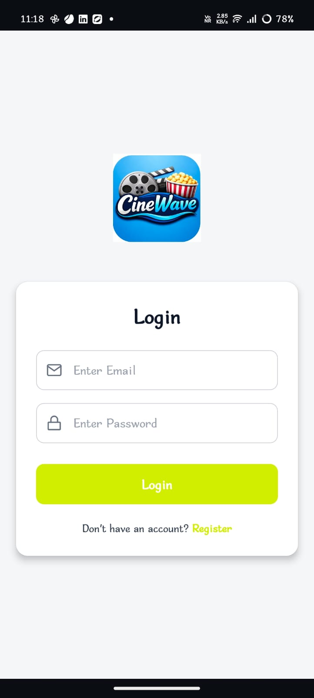
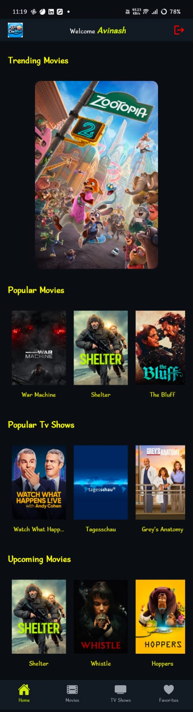
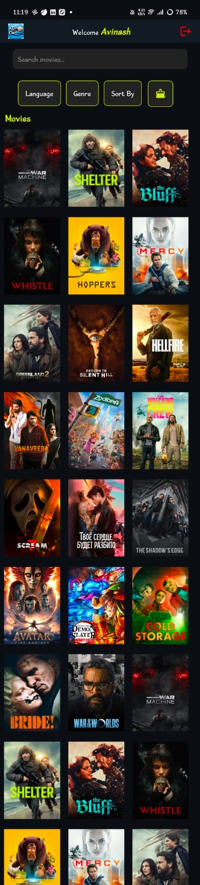
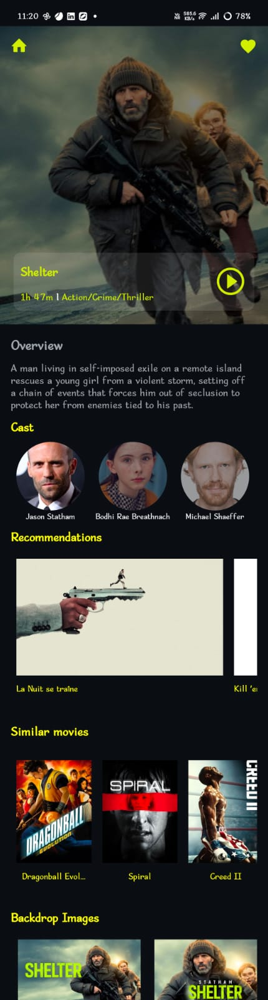
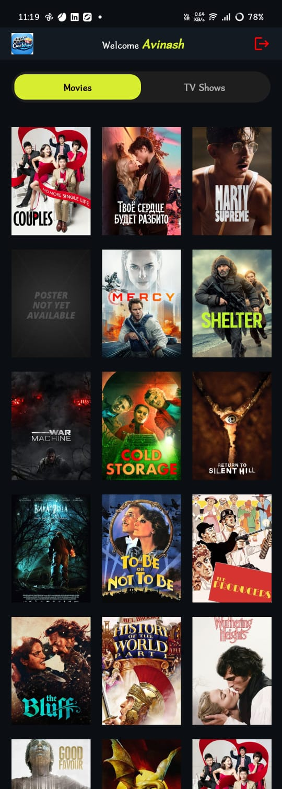

# 🎬 Movies Explorer App (React Native + Expo)


A modern **Movies & TV Shows Explorer App** built using **React Native (Expo)** and **TMDB API**.

Users can discover trending and upcoming movies, search for movies or TV shows, view detailed information, watch trailers, and manage favorite movies with **Firebase Authentication**.

---

# 🚀 Features

## 🔎 Search

* Search for **Movies and TV Shows**
* Instant search results

## 🎬 Movies Discovery

* View **Trending Movies**
* View **Upcoming Movies**
* Browse **Popular Movies**

## 🎛 Filters & Sorting

Sort movies by:

* Popularity
* Rating / Vote Average
* Release Date
* Revenue
* Title
* Original Title
* Vote Count

Filter movies by **language**

## 📄 Movie Details Page

Each movie has a **dynamic details page** with:

* Movie Title & Poster
* Backdrop Images
* Movie Overview
* Cast Details
* Movie Trailer (YouTube)
* Recommended Movies
* Similar Movies

## 🎭 Cast Details

* Cast biography
* Social media links
* Movies & TV Shows they appeared in

## ⭐ Favorites

* Add movies to **Favorites**
* View saved movies
* Quick access to favorite movies

---

# 🛠 Tech Stack

* React Native
* Expo
* Expo Router
* TypeScript
* Axios
* TMDB API
* Firebase Authentication
* React Hooks
* Custom Hooks
* Reusable Components

---

# 📱 Screenshots

<p align="center">



</p>

<p align="center">



</p>

<p align="center">

</p>

---

# 📁 Project Structure

```
app
 ├── login.tsx
 ├── register.tsx
 ├── movie-details
 ├── cast-details
 └── (tabs)

src
 ├── api
 ├── components
 ├── hooks
 ├── screens
 ├── theme
 └── utils
```

---

# 📦 Installation

Clone the repository

```bash
git clone https://github.com/Avinashpotnuru/movies-app-native.git
```

Go to the project directory

```bash
cd movies-app-native
```

Install dependencies

```bash
npm install
```

---

# ▶ Run the Project

Start development server

```bash
npx expo start
```

Run on Android

```bash
npx expo start --android
```

Run on iOS

```bash
npx expo start --ios
```

---

# 🔑 Environment Variables

Create a `.env` file in the root folder.

```env
EXPO_PUBLIC_TMDB_API_KEY=your_api_key
EXPO_PUBLIC_BASE_URL=https://api.themoviedb.org/3
EXPO_PUBLIC_ACCESS_TOKEN=your_access_token

EXPO_PUBLIC_FIREBASE_API_KEY=your_firebase_api_key
EXPO_PUBLIC_FIREBASE_AUTH_DOMAIN=your_project.firebaseapp.com
EXPO_PUBLIC_FIREBASE_PROJECT_ID=your_project_id
EXPO_PUBLIC_FIREBASE_STORAGE_BUCKET=your_project.appspot.com
EXPO_PUBLIC_FIREBASE_MESSAGING_SENDER_ID=your_sender_id
EXPO_PUBLIC_FIREBASE_APP_ID=your_app_id
```

---

# 🌐 API

This project uses **TMDB API**

https://www.themoviedb.org/documentation/api

---

# 📱 Screens

* Home Screen
* Movies Page
* Movie Details Page
* Cast Details Page
* Favorites Page
* Search Page
* Login Page
* Register Page

---

# ⭐ Future Improvements

* Watchlist
* Offline Favorites
* Pagination
* Better animations
* Dark / Light theme support

---

# 🚀 Live Demo

Expo build

https://expo.dev/accounts/avinash343/projects/cinewave/builds/98a24a9f-b687-4d13-9f9f-35aaa4a67cc6

---

# 👨‍💻 Author

**Avinash Potnuru**

GitHub
https://github.com/Avinashpotnuru

Built with ❤️ using **React Native + Expo**
