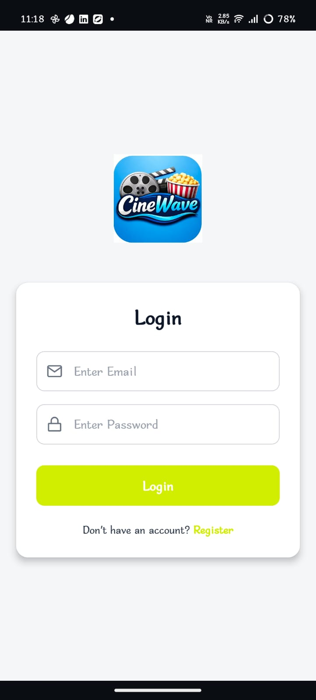
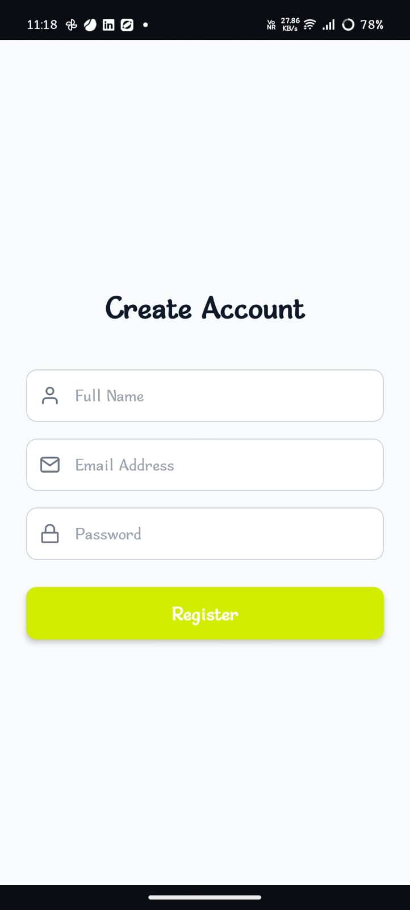
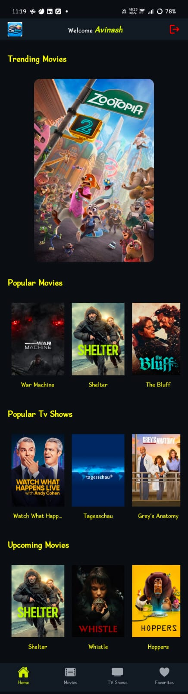
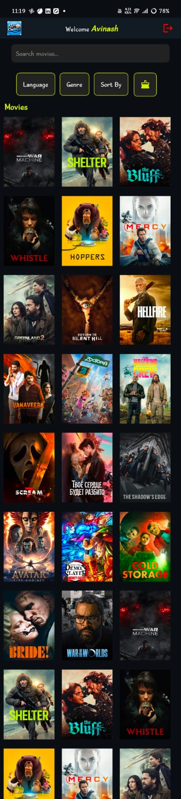
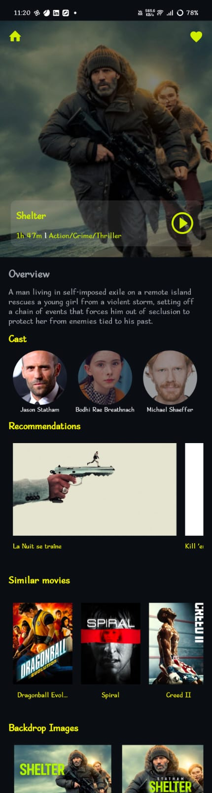
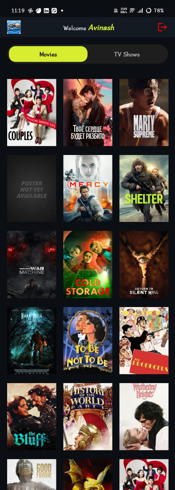

# 🎬 Movies Explorer App (React Native + Expo)


A modern **Movies & TV Shows Explorer App** built using **React Native (Expo)** and **TMDB API**.

Users can discover trending and upcoming movies, search for movies or TV shows, view detailed information, watch trailers, and manage favorite movies with **Firebase Authentication**.

---

# 🚀 Features

## 🔎 Search

- Search for **Movies and TV Shows**
- Instant search results

## 🎬 Movies Discovery

- View **Trending Movies**
- View **Upcoming Movies**
- Browse **Popular Movies**

## 🎛 Filters & Sorting

Sort movies by:

- Popularity
- Rating / Vote Average
- Release Date
- Revenue
- Title
- Original Title
- Vote Count

Filter movies by **language**

## 📄 Movie Details Page

Each movie has a **dynamic details page** with:

- Movie Title & Poster
- Backdrop Images
- Movie Overview
- Cast Details
- Movie Trailer (YouTube)
- Recommended Movies
- Similar Movies

## 🎭 Cast Details

- Cast biography
- Social media links
- Movies & TV Shows they appeared in

## ⭐ Favorites

- Add movies to **Favorites**
- View saved movies
- Quick access to favorite movies

---

# 🛠 Tech Stack

- React Native
- Expo
- Expo Router
- TypeScript
- Axios
- TMDB API
- Firebase Authentication
- React Hooks
- Custom Hooks
- Reusable Components
- Tanstack React Query

---

# 📱 Screenshots

<p>




</p>

<p>




</p>

---

# 📁 Project Structure

```
movies-app-native
├─ .env
├─ .qodo
├─ app
│  ├─ (tabs)
│  │  ├─ favorites.tsx
│  │  ├─ index.tsx
│  │  ├─ movies.tsx
│  │  ├─ tvshows.tsx
│  │  └─ _layout.tsx
│  ├─ cast-details
│  │  └─ [id].tsx
│  ├─ login.tsx
│  ├─ movie-details
│  │  └─ [id].tsx
│  ├─ register.tsx
│  └─ _layout.tsx
├─ app.json
├─ assets
│  └─ images
│     ├─ adaptive-icon.png
│     ├─ cineWaveLogo.png
│     ├─ cineWaveLogoBg.png
│     ├─ favicon.png
│     ├─ female.jpg
│     ├─ icon.png
│     ├─ loading.gif
│     ├─ male.jpg
│     ├─ partial-react-logo.png
│     ├─ placeholder.jpg
│     ├─ react-logo.png
│     ├─ react-logo@2x.png
│     ├─ react-logo@3x.png
│     ├─ splash-icon.png
│     └─ splash.png
├─ data
│  └─ index.ts
├─ eas.json
├─ es.json
├─ eslint.config.js
├─ package-lock.json
├─ package.json
├─ README.md
├─ screenshots
│  ├─ castDetailPageImage.jpeg
│  ├─ favouritePageImage.jpeg
│  ├─ landingPageImage.jpeg
│  ├─ loginPageImage.jpeg
│  ├─ movieDetailsPageImage.jpeg
│  ├─ moviesPageImage.jpeg
│  └─ RegisterPageImage.jpeg
├─ src
│  ├─ api
│  │  ├─ authService.ts
│  │  ├─ axios-interceptors.ts
│  │  ├─ endpoints.ts
│  │  ├─ movies.service.ts
│  │  └─ queryOptions.ts
│  ├─ components
│  │  ├─ backdrop-images-container.tsx
│  │  ├─ biography-section.tsx
│  │  ├─ cast-container.tsx
│  │  ├─ cast-display-card.tsx
│  │  ├─ custom-dropdown.tsx
│  │  ├─ display-modal.tsx
│  │  ├─ index.ts
│  │  ├─ loading.tsx
│  │  ├─ movie-list-container.tsx
│  │  ├─ movie-overview.tsx
│  │  ├─ movie-title-card.tsx
│  │  ├─ movies-card.tsx
│  │  ├─ movies-carousel.tsx
│  │  ├─ movies-list-wrapper.tsx
│  │  ├─ no-data-found.tsx
│  │  ├─ recommendation-card.tsx
│  │  ├─ recommendation-section.tsx
│  │  ├─ section-heading.tsx
│  │  ├─ social-media-section.tsx
│  │  ├─ tab-header.tsx
│  │  ├─ tabs-container.tsx
│  │  └─ trailer-video.tsx
│  ├─ config
│  │  └─ firebase.ts
│  ├─ hooks
│  │  ├─ index.ts
│  │  ├─ useAddFavorite.tsx
│  │  ├─ useAuthRedirect.tsx
│  │  ├─ useDebounce.tsx
│  │  ├─ useDimensions.tsx
│  │  ├─ useGetCastDetails.tsx
│  │  ├─ useGetFavoriteMovies.tsx
│  │  ├─ useGetFavoriteTvShows.tsx
│  │  ├─ useGetGenres.tsx
│  │  ├─ useGetLanguages.tsx
│  │  ├─ useGetMovieCredits.tsx
│  │  ├─ useGetMovieDetail.tsx
│  │  ├─ useGetMovies.tsx
│  │  ├─ useGetTvShowsInfinite.tsx
│  │  ├─ usePopularMovies.tsx
│  │  ├─ useSearchMovies.tsx
│  │  ├─ useSearchTvShows.tsx
│  │  ├─ useTrendingMovies.tsx
│  │  ├─ useTvShows.tsx
│  │  └─ useUpcomingMovies.tsx
│  ├─ layout
│  │  ├─ app-stack-layout.tsx
│  │  ├─ index.ts
│  │  └─ tabs-stack-layout.tsx
│  ├─ screens
│  │  ├─ cast-overview.tsx
│  │  ├─ favorites-container.tsx
│  │  ├─ home-container.tsx
│  │  ├─ index.ts
│  │  ├─ movies-details-container.tsx
│  │  ├─ movies-filter-container.tsx
│  │  └─ tv-shows-filter-container.tsx
│  ├─ store
│  ├─ theme
│  │  ├─ colors.ts
│  │  └─ index.ts
│  ├─ types
│  │  ├─ index.ts
│  │  └─ movie.types.ts
│  └─ utils
│     ├─ errorMessages.ts
│     ├─ getImage.ts
│     └─ responsive.ts
└─ tsconfig.json

```

---

# 📦 Installation

Clone the repository

```bash
git clone https://github.com/Avinashpotnuru/movies-app-native.git
```

Go to the project directory

```bash
cd movies-app-native
```

Install dependencies

```bash
npm install
```

---

# ▶ Run the Project

Start development server

```bash
npx expo start
```

Run on Android

```bash
npx expo start --android
```

Run on iOS

```bash
npx expo start --ios
```

---

# 🔑 Environment Variables

Create a `.env` file in the root folder.

```env
EXPO_PUBLIC_TMDB_API_KEY=your_api_key
EXPO_PUBLIC_BASE_URL=https://api.themoviedb.org/3
EXPO_PUBLIC_ACCESS_TOKEN=your_access_token

EXPO_PUBLIC_FIREBASE_API_KEY=your_firebase_api_key
EXPO_PUBLIC_FIREBASE_AUTH_DOMAIN=your_project.firebaseapp.com
EXPO_PUBLIC_FIREBASE_PROJECT_ID=your_project_id
EXPO_PUBLIC_FIREBASE_STORAGE_BUCKET=your_project.appspot.com
EXPO_PUBLIC_FIREBASE_MESSAGING_SENDER_ID=your_sender_id
EXPO_PUBLIC_FIREBASE_APP_ID=your_app_id
```

---

# 🌐 API

This project uses **TMDB API**

https://www.themoviedb.org/documentation/api

---

# 📱 Screens

- Home Screen
- Movies Page
- Movie Details Page
- Cast Details Page
- Favorites Page
- Search Page
- Login Page
- Register Page

---

# ⭐ Future Improvements

- Watchlist
- Offline Favorites
- Pagination
- Better animations
- Dark / Light theme support

---

# 🚀 Live Demo

Expo build Download apk file below link

https://expo.dev/accounts/avinash343/projects/cinewave/builds/8a190587-f958-4835-8d0c-14bea762d1dd

---

# 👨‍💻 Author

**Avinash Potnuru**

GitHub
https://github.com/Avinashpotnuru

Built with ❤️ using **React Native + Expo**


